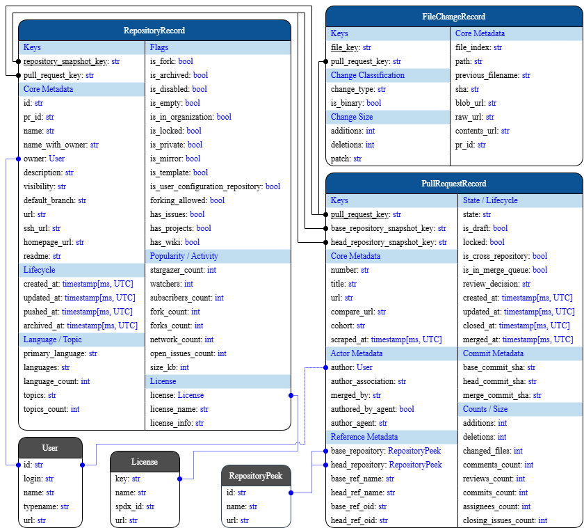
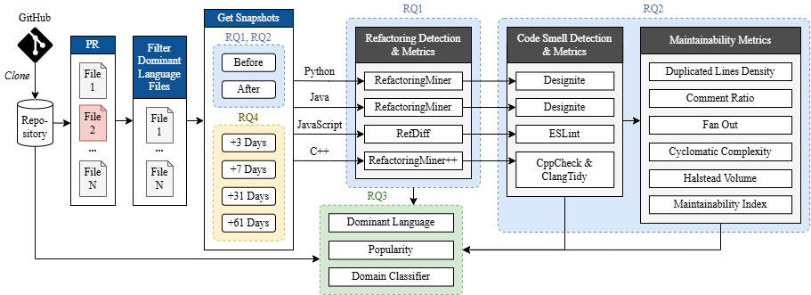

# Merged, but Maintained? Refactoring and Maintainability in Agent-Authored Pull Requests

This repository contains the extraction, curation, topic-classification,
analysis, and data-publication code used to study refactoring and
maintainability in agent- and human-authored pull requests. The pipeline is
organized as independent stages with local outputs first: each stage can be run,
inspected, resumed, and packaged before any upload step is executed.

Step-by-step run instructions are maintained in the README for each component.
Use the [Pipeline Flow](#pipeline-flow) table below to jump to the README for
the stage you want to run.

## Dataset Availability

The candidate dataset is available on Hugging Face at
[OSAPRD/OSAPRD](https://huggingface.co/datasets/OSAPRD/OSAPRD). You can either
download those data products and continue from the relevant downstream stage, or
run the extraction stage to rebuild local GitHub-scraped inputs.

The repository keeps upload/publishing separate from extraction and curation:

- Extraction writes local GitHub PR parquet outputs.
- Curation reads extraction parquet or downloaded source data and writes local
  curated outputs.
- Upload stages prepare Hugging Face dataset layouts from local outputs and can
  run dry-run upload plans before publishing.



The extraction data diagram above summarizes the candidate PR data model produced by
live GitHub scraping and uploaded on Hugging Face.

## Pipeline Flow

```text
GitHub scraping or downloaded candidate data
  -> extraction
  -> curation
  -> topic classification
  -> analysis
  -> upload extraction data / upload curation data
```

| Stage                  | Purpose                                                                                                                                             | Main README                                                                                          |
| ---------------------- | --------------------------------------------------------------------------------------------------------------------------------------------------- | ---------------------------------------------------------------------------------------------------- |
| Extraction             | Discover and enrich candidate PRs from live GitHub scraping.                                                                                        | [extraction/README.md](extraction/README.md)                                                         |
| Curation               | Sample/filter PRs, hydrate snapshots, run refactoring mining, compute Multimetric/custom maintainability metrics, and collect code smells.          | [curation/README.md](curation/README.md)                                                             |
| Topic classification   | Extract topic-labeled repositories, prepare training data, train the model, and classify curated repositories into topic/domain labels.             | [post-processing/topic-classification/README.md](post-processing/topic-classification/README.md)     |
| Analysis               | Run the dataset, refactoring, and maintainability analysis pipelines and write summaries/plots.                                                     | [post-processing/analysis/README.md](post-processing/analysis/README.md)                             |
| Upload extraction data | Convert local extraction outputs into a public Hugging Face dataset layout and optionally upload it.                                                | [post-processing/upload-extraction-data/README.md](post-processing/upload-extraction-data/README.md) |
| Upload curation data   | Convert local curation outputs, topic labels, and optional longitudinal outputs into a public Hugging Face dataset layout and optionally upload it. | [post-processing/upload-curation-data/README.md](post-processing/upload-curation-data/README.md)     |

Docker is the recommended runtime for each stage. Local execution is also
documented in each stage README. Tokens are always read from environment
variables, and manifests record only redacted credential state.



The enrichment and analysis diagram shows how curated PR snapshots move from
repository cloning and dominant-language file selection into metric collection.
The before/after snapshots support merge-time refactoring, smell, and
maintainability analyses for RQ1 and RQ2; future snapshots support the
longitudinal analysis for RQ4; repository language, popularity, and domain
metadata support the repository-characteristic analyses for RQ3.

## Research Questions and Code Mapping

The codebase supports four research questions:

| RQ  | Question                                                                                                                               | How the components answer it                                                                                                                                                                                                         | Primary code paths                                                                                                                                                                                                                                                                                                                                                                |
| --- | -------------------------------------------------------------------------------------------------------------------------------------- | ------------------------------------------------------------------------------------------------------------------------------------------------------------------------------------------------------------------------------------ | --------------------------------------------------------------------------------------------------------------------------------------------------------------------------------------------------------------------------------------------------------------------------------------------------------------------------------------------------------------------------------- |
| RQ1 | How do agent- and human-authored PRs differ in the frequency, type, and scope of refactorings?                                         | Curation mines PR-level refactoring operations, standardizes tool-specific labels, maps them to Murphy-Hill taxonomy levels, and analysis compares operation counts, diversity, line/file scope, and cohort-level distributions.     | `curation/metrics/refactoring_metrics.py`, `curation/config/refactoring_standardization_config.py`, `curation/config/refactoring_taxonomy_config.py`, `post-processing/analysis/pipelines/refactoring_analysis_pipeline.py`, `post-processing/analysis/pipelines/characteristics_refactoring_pipeline.py`                                                                         |
| RQ2 | What are the differences in maintainability outcomes between agent- and human-authored PRs?                                            | Curation computes before/after maintainability metrics, duplicated-lines density, and code-smell findings; analysis compares metric deltas and smell profiles between cohorts and repository strata.                                 | `curation/metrics/maintainability_multimetric_metrics.py`, `curation/metrics/code_smell_metrics.py`, `curation/config/code_smell_standardization_config.py`, `curation/config/code_smell_taxonomy_config.py`, `post-processing/analysis/pipelines/maintainability_analysis_pipeline.py`, `post-processing/analysis/pipelines/characteristics_maintainability_metrics_pipeline.py` |
| RQ3 | To what extent do repository characteristics relate to refactoring behavior and maintainability effects in agent-assisted development? | Topic classification and dataset analysis enrich PRs with repository/domain characteristics; characteristic pipelines relate those labels and repository attributes to refactoring and maintainability outcomes.                     | `post-processing/topic-classification/`, `post-processing/analysis/pipelines/dataset_analysis_pipeline.py`, `post-processing/analysis/pipelines/characteristics_refactoring_pipeline.py`, `post-processing/analysis/pipelines/characteristics_maintainability_metrics_pipeline.py`                                                                                                |
| RQ4 | How do agent-authored contributions evolve after merge in terms of refactoring activity and maintainability?                           | Hydration captures later snapshots for selected PRs; curation tracks original PR/refactoring-zone lines and future maintainability snapshots, while longitudinal analysis summarizes persistence and post-merge metric trajectories. | `curation/pipeline/hydration_pipeline.py`, `curation/metrics/refactoring_metrics.py`, `curation/metrics/maintainability_multimetric_metrics.py`, `post-processing/analysis/pipelines/longitudinal_refactoring_pipeline.py`, `post-processing/analysis/pipelines/longitudinal_maintainability_metrics_pipeline.py`                                                                 |

## Metrics and Tooling

Curation computes:

- Refactoring operations from RefactoringMiner, RefDiff, and
  RefactoringMiner++ on the original PR before/after comparison.
- Code-smell findings from DesigniteJava, DesignitePython/DPy, PMD, ESLint,
  Cppcheck, and clang-tidy where the relevant language/tool is available.
- Maintainability metrics from Multimetric for maintainability index,
  cyclomatic complexity, Halstead volume, fan out, comment ratio, and LOC.
- Duplicated-lines density from this repository's custom deterministic
  implementation.
- Future-snapshot metrics by tracking selected PRs through later snapshots; the
  active curation pipeline does not rerun refactoring tools on future snapshots.

## Refactoring Taxonomy Mapping

Standardized refactoring operation labels are mapped to Murphy-Hill abstraction
levels in [curation/config/refactoring_taxonomy_config.py](curation/config/refactoring_taxonomy_config.py).

| Murphy-Hill level | Standardized refactoring operations                                                                                                                                                                                                                                                                                                                                                                                                                                                                                                                                                                                                                                                                                                                                                                                                                                                                                                                                                                                                                                                                                                                                                                                                                                                                                                                                                                                                                                                                                                                                                                                                 |
| ----------------- | ----------------------------------------------------------------------------------------------------------------------------------------------------------------------------------------------------------------------------------------------------------------------------------------------------------------------------------------------------------------------------------------------------------------------------------------------------------------------------------------------------------------------------------------------------------------------------------------------------------------------------------------------------------------------------------------------------------------------------------------------------------------------------------------------------------------------------------------------------------------------------------------------------------------------------------------------------------------------------------------------------------------------------------------------------------------------------------------------------------------------------------------------------------------------------------------------------------------------------------------------------------------------------------------------------------------------------------------------------------------------------------------------------------------------------------------------------------------------------------------------------------------------------------------------------------------------------------------------------------------------------------- |
| Low               | Add Parameter Modifier<br>Add Variable Annotation<br>Add Variable Modifier<br>Assert Throws<br>Assert Timeout<br>Change Variable Type<br>Extract Variable<br>Inline Variable<br>Invert Condition<br>Merge Catch<br>Merge Conditional<br>Merge Variable<br>Modify Variable Annotation<br>Move Code<br>Remove Parameter Modifier<br>Remove Variable Annotation<br>Remove Variable Modifier<br>Rename Parameter<br>Rename Variable<br>Replace Anonymous with Lambda<br>Replace Attribute<br>Replace Conditional with Assumption<br>Replace Conditional With Ternary<br>Replace Generic With Diamond<br>Replace Loop with Pipeline<br>Replace Pipeline with Loop<br>Split Conditional<br>Split Variable<br>Try With Resources                                                                                                                                                                                                                                                                                                                                                                                                                                                                                                                                                                                                                                                                                                                                                                                                                                                                                                           |
| Medium            | Change Attribute Type<br>Change Parameter Type<br>Change Return Type<br>Extract<br>Extract And Move<br>Extract And Move Method<br>Extract Attribute<br>Extract Class<br>Extract Fixture<br>Extract Method<br>Extract Subclass<br>Inline<br>Inline Attribute<br>Inline Method<br>Localize Parameter<br>Merge Method<br>Move And Inline Method<br>Parameterize Attribute<br>Replace Anonymous with Class<br>Replace Attribute with Variable<br>Replace Variable with Attribute<br>Split Class<br>Split Method                                                                                                                                                                                                                                                                                                                                                                                                                                                                                                                                                                                                                                                                                                                                                                                                                                                                                                                                                                                                                                                                                                                         |
| High              | Add Attribute Annotation<br>Add Attribute Modifier<br>Add Class Annotation<br>Add Class Modifier<br>Add Method Annotation<br>Add Method Modifier<br>Add Parameter<br>Add Parameter Annotation<br>Add Thrown Exception Type<br>Change Attribute Access Modifier<br>Change Class Access Modifier<br>Change Method Access Modifier<br>Change Signature<br>Change Signature of Function<br>Change Signature of Method<br>Change Thrown Exception Type<br>Change Type Declaration Kind<br>Collapse Hierarchy<br>Convert Type<br>Encapsulate Attribute<br>Extract Interface<br>Extract Superclass<br>Extract Supertype<br>Internal Move<br>Internal Move And Rename<br>Merge Attribute<br>Merge Class<br>Merge Package<br>Merge Parameter<br>Modify Attribute Annotation<br>Modify Class Annotation<br>Modify Method Annotation<br>Modify Parameter Annotation<br>Move<br>Move And Rename<br>Move And Rename Attribute<br>Move And Rename Class<br>Move And Rename Method<br>Move Annotation<br>Move Attribute<br>Move Class<br>Move Method<br>Move Package<br>Parameterize Test<br>Parameterize Variable<br>Pull Up<br>Pull Up Attribute<br>Pull Up Method<br>Push Down<br>Push Down Attribute<br>Push Down Method<br>Remove Attribute Annotation<br>Remove Attribute Modifier<br>Remove Class Annotation<br>Remove Class Modifier<br>Remove Method Annotation<br>Remove Method Modifier<br>Remove Parameter<br>Remove Parameter Annotation<br>Remove Thrown Exception Type<br>Rename<br>Rename Attribute<br>Rename Class<br>Rename Method<br>Rename Package<br>Reorder Parameter<br>Split Attribute<br>Split Package<br>Split Parameter |

## Code-Smell Taxonomy Mapping

Standardized code-smell labels are mapped to Mantyla categories in
[curation/config/code_smell_taxonomy_config.py](curation/config/code_smell_taxonomy_config.py).

| Mantyla category           | Standardized code smells                                                                                                                                                                                                                                                                                                                                                                                                                                                                                                                                                                                                                                                                                                                                                                                                                                                                                                                                                                                                                                                                                                                                                                                                                                                                                                                                                        |
| -------------------------- | ------------------------------------------------------------------------------------------------------------------------------------------------------------------------------------------------------------------------------------------------------------------------------------------------------------------------------------------------------------------------------------------------------------------------------------------------------------------------------------------------------------------------------------------------------------------------------------------------------------------------------------------------------------------------------------------------------------------------------------------------------------------------------------------------------------------------------------------------------------------------------------------------------------------------------------------------------------------------------------------------------------------------------------------------------------------------------------------------------------------------------------------------------------------------------------------------------------------------------------------------------------------------------------------------------------------------------------------------------------------------------- |
| Bloaters                   | Callback Hell<br>Complex Method<br>Data Clumps / Too Many Parameters<br>Deep Nesting<br>Dense Structure<br>Escaping Complexity<br>Excessive Copying<br>Excessive Nesting<br>Feature Concentration<br>God Component<br>Ineffective Move Semantics<br>Inefficient Abstraction<br>Inefficient Construction<br>Inefficient Data Handling<br>Inefficient Data Passing<br>Inefficient Loop<br>Inefficient Search<br>Insufficient Modularization<br>IO Performance Smell<br>Long Identifier<br>Long Lambda Function<br>Long Method<br>Long Parameter List<br>Long Statement<br>Loop Inefficiency<br>Loop Logic Smell<br>Low-Level Obsession<br>Magic Number<br>Minor Inefficiency<br>Missed Move Optimization<br>Multifaceted Abstraction<br>Overcomplicated Control Flow<br>Overcomplicated Looping<br>Overly Long File<br>Oversized Representation<br>Pass-by-Value Smell<br>Performance Bottleneck<br>Performance Smell<br>Primitive Obsession<br>Resource Waste<br>Temporary Object<br>Too Many Responsibilities<br>Unnecessary Iteration<br>Variable Scope Too Large<br>Verbose Conditional<br>Verbose Construction<br>Verbose Logic<br>Verbose Type Declaration                                                                                                                                                                                                                  |
| Object-orientation abusers | Abstract Function Call From Constructor<br>Broken Hierarchy<br>Constructor Initialization<br>Cyclic Hierarchy<br>Deep Hierarchy<br>Fragile Inheritance<br>Imperative Abstraction<br>Incomplete Initialization<br>Incomplete Object Semantics<br>Incorrect Initialization<br>Inheritance Misuse<br>Large Switch Statement<br>Missing Default<br>Missing Hierarchy<br>Multipath Hierarchy<br>Poor Construction<br>Primitive Misuse<br>Rebellious Hierarchy<br>Redundant Initialization<br>Refused Bequest<br>Switch Statements Too Large<br>Temporary Field<br>Temporary Field / Unused State<br>Type Blind Conversion<br>Unsafe Conversion<br>Unsafe Type Conversion<br>Wide Hierarchy                                                                                                                                                                                                                                                                                                                                                                                                                                                                                                                                                                                                                                                                                           |
| Change preventers          | Ambiguous Control Flow<br>Ambiguous Merge Key<br>Boolean Blindness / Confusing Booleans<br>Broken Modularization<br>Chain Indexing<br>Collection Misuse<br>Complex Conditional<br>Complex Conditional / Boolean Complexity<br>Conditional Complexity<br>Confusing Conditional<br>Cyclic Dependency<br>Cyclically-Dependent Modularization<br>Dangling Reference<br>Escaping Temporary<br>Exception Handling<br>Exception Swallowing<br>Faulty Control Flow<br>Forward Bypass<br>Global Initialization Dependency<br>Hidden Behavior<br>Hidden Semantics<br>Hidden Side Effects<br>Incomplete Conditional Logic<br>Incomplete Error Handling<br>Inconsistent Behavior<br>Inconsistent Resource Management<br>Inconsistent State<br>Incorrect Collection Usage<br>Invalid Object State<br>Lifetime Mismanagement<br>Manual Resource Management<br>Memory Leak<br>Mutable Shared State<br>Mutable State Smell<br>Obscure Control Flow<br>One-Iteration Loops<br>Ownership Confusion<br>Ownership Mismanagement<br>Poor Exception Handling<br>Repeated Conditions<br>Resource Leak<br>Scattered Functionality<br>Spaghetti Code<br>Suspicious Control Flow<br>Suspicious Equality / Hidden Bugs<br>Unnecessary Complexity<br>Unsafe Collection Handling<br>Unsafe Memory Management<br>Unsafe Ownership<br>Unsafe Resource Handling<br>Unsafe State Handling<br>Unstable Dependency |
| Dispensables               | Boilerplate Code<br>Data Class<br>Dead Abstraction<br>Dead Branches<br>Dead Code<br>Dead Code / Lazy Class<br>Dead Parameter<br>Dead State<br>Dead Store / Dead Code<br>Duplicate Abstraction<br>Duplicate Branches<br>Duplicate Code<br>Duplicate Logic<br>Empty Catch Clause<br>Empty Test<br>Ignored Behavior<br>Ignored Test<br>Lazy / Redundant Statements<br>Lazy Class<br>Lazy Class / Empty Abstraction<br>Macro Abuse<br>Obsolete Abstraction<br>Obsolete API Usage<br>Obsolete Language Usage<br>Obsolete Ownership Model<br>Obsolete Typedef Style<br>Preprocessor Abuse<br>Redundant Code<br>Redundant Conditional Logic<br>Redundant Control Flow<br>Redundant Copying<br>Redundant Logic<br>Redundant State<br>Redundant Statements<br>Speculative Generality<br>Temporary Variable<br>Unnecessary Abstraction<br>Unused Collections Or Values<br>Unutilized Abstraction<br>Write-only Variable                                                                                                                                                                                                                                                                                                                                                                                                                                                                   |
| Encapsulators              | Deficient Encapsulation<br>Global Data<br>Global State<br>Global State Abuse<br>Poor Self-Documentation<br>Unexploited Encapsulation                                                                                                                                                                                                                                                                                                                                                                                                                                                                                                                                                                                                                                                                                                                                                                                                                                                                                                                                                                                                                                                                                                                                                                                                                                            |
| Couplers                   | Ambiguous API Design<br>Confusing API Calls<br>Confusing API Usage<br>Excessive Coupling / Recursive Complexity<br>Excessive Dependency<br>Feature Envy<br>Hard-wired Dependencies<br>Hub-like Modularization<br>Inappropriate Intimacy with Container<br>Law of Demeter Violation<br>Long Message Chain<br>Temporal Coupling<br>Unsafe Dynamic Code                                                                                                                                                                                                                                                                                                                                                                                                                                                                                                                                                                                                                                                                                                                                                                                                                                                                                                                                                                                                                            |
| Others                     | Ambiguous Interface<br>Assertion Roulette<br>Broken NaN Check<br>Conditional Test Logic<br>Confusing Names<br>Eager Test<br>Fragile Assignment Semantics<br>Inconsistent Style<br>Incorrect Memory Semantics<br>Incorrect String Logic<br>Missing Assertion<br>Obscure Intent<br>Obscure Type Semantics<br>Parsing Error<br>Poor Naming<br>Undefined State<br>Unknown Test<br>Unsafe Exception Flow<br>Unsafe Memory Operations<br>Unsafe String Logic<br>Use After Free                                                                                                                                                                                                                                                                                                                                                                                                                                                                                                                                                                                                                                                                                                                                                                                                                                                                                                        |

## Third-Party Notices

Third-party tooling licenses/notices are maintained in
[THIRD_PARTY_NOTICES.md](THIRD_PARTY_NOTICES.md). That file covers active
refactoring tools, maintainability tools, code-smell tools, Docker build
dependencies, and legacy compatibility references.

Before redistributing a Docker image, dataset package, or archive, verify the
exact licenses of any locally mounted or vendored tool binaries.

## AI Acknowledgement

[GPT-5.2-Codex](https://openai.com/index/introducing-gpt-5-5/) assisted with
code generation, refactoring, debugging, and documentation. All AI-generated
code was reviewed, modified, and validated by the author. AI assistance was not
used to fabricate results, generate data, or replace evaluation. Key pipeline
components, including refactoring detection, smell analysis, taxonomy mappings,
metric computation, and data upload procedures, were manually validated on
dataset samples and, where possible, compared against third-party libraries. All
scientific contributions, interpretations, and conclusions are the author's own,
and responsibility for the study's accuracy, validity, and integrity remains
with the author.

## Practical Notes

- Prefer Docker for full-stage execution; each stage README gives Docker-first
  commands and local alternatives.
- Configure GitHub tokens through `GITHUB_TOKENS` or `GITHUB_TOKEN`.
- Configure Hugging Face upload tokens through `HF_TOKEN`,
  `HUGGINGFACE_HUB_TOKEN`, or `HUGGING_FACE_HUB_TOKEN`.
- Keep extraction, curation, analysis, and upload outputs in separate local
  directories so staged runs remain resumable and auditable.
- Use upload `--dry-run` commands before publishing prepared Hugging Face
  dataset layouts.

## References

These references cover the main third-party tools, taxonomy mappings, and
metric definitions used by the pipeline. Numbered entries mirror the report
bibliography where applicable; PMD is included separately because it is an
active code-smell tool in this repository.

[38] N. Tsantalis, M. Mansouri, L. Eshkevari, D. Mazinanian, and D. Dig,
"Accurate and efficient refactoring detection in commit history," in
Proceedings of the 40th IEEE/ACM International Conference on Software
Engineering (ICSE '18), May 2018, pp. 483-494.

[49] D. Silva and M. T. Valente, "RefDiff: Detecting refactorings in version
histories," in Proceedings of the 14th IEEE/ACM International Conference on
Mining Software Repositories (MSR '17), May 2017, pp. 269-279.

[50] B. Ritz, A. Karakas, and D. Helic, "Refactoring detection in C++ programs
with RefactoringMiner++," in Proceedings of the 33rd ACM International
Conference on the Foundations of Software Engineering (FSE Companion '25),
Association for Computing Machinery, Jul. 2025, pp. 1163-1167.

[51] E. Murphy-Hill, C. Parnin, and A. P. Black, "How we refactor, and how we
know it," IEEE Transactions on Software Engineering, vol. 38, no. 1, pp. 5-18,
Jan. 2012.

[52] T. Sharma, P. Mishra, and R. Tiwari, "Designite - a software design
quality assessment tool," in Proceedings of the 1st IEEE/ACM International
Workshop on Bringing Architectural Design Thinking Into Developers' Daily
Activities (BRIDGE '16), May 2016, pp. 1-4.

[53] T. Sharma, "Multi-faceted code smell detection at scale using
DesigniteJava 2.0," in Proceedings of the 21st International Conference on
Mining Software Repositories (MSR '24), Association for Computing Machinery,
Jul. 2024, pp. 284-288.

[54] ESLint, "ESLint documentation," accessed Jun. 1, 2026. [Online].
Available: https://eslint.org/docs/v10.x/

[55] LLVM Project, "Clang-Tidy documentation," accessed Jun. 1, 2026.
[Online]. Available: https://clang.llvm.org/extra/clang-tidy/

[56] Cppcheck, "Cppcheck - a tool for static C/C++ code analysis," accessed
Jun. 1, 2026. [Online]. Available: https://cppcheck.sourceforge.io/

[57] M. Mantyla, J. Vanhanen, and C. Lassenius, "A taxonomy and an initial
empirical study of bad smells in code," in Proceedings of the 19th
International Conference on Software Maintenance (ICSM '03), IEEE Computer
Society, Sep. 2003, pp. 381-384.

[58] M. Izadi, A. Heydarnoori, and G. Gousios, "Topic recommendation for
software repositories using multi-label classification algorithms," Empirical
Software Engineering, vol. 26, no. 5, Jul. 2021.

[61] T. J. McCabe, "A complexity measure," IEEE Transactions on Software
Engineering, vol. SE-2, no. 4, pp. 308-320, Dec. 1976.

[62] M. H. Halstead, Elements of Software Science, ser. Operating and
Programming Systems Series. Elsevier Science Inc., May 1977.

[64] Lite Solutions, "SEI maintainability index," accessed Jun. 30, 2026.
[Online]. Available:
https://objectscriptquality.com/docs/metrics/sei-maintanability-index

[65] P. Oman and J. Hagemeister, "Metrics for assessing a software system's
maintainability," in Proceedings of the 8th IEEE Conference on Software
Maintenance (ICSM '92), Nov. 1992, pp. 337-344.

[66] P. Oman and J. Hagemeister, "Construction and testing of polynomials
predicting software maintainability," Journal of Systems and Software, vol.
24, no. 3, pp. 251-266, Mar. 1994.

[67] MultiMetric, "Multimetric," Jun. 2026. [Online]. Available:
https://github.com/priv-kweihmann/multimetric

[PMD] PMD Project, "PMD documentation." [Online]. Available:
https://pmd.github.io/
